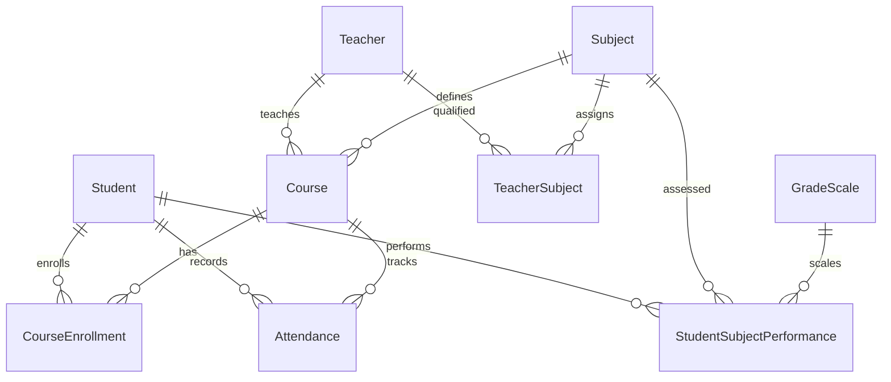

# Technical Documentation

## System Architecture Overview

### High-Level Architecture

The Uganda Curriculum School Management System follows a layered architecture pattern built on ASP.NET Core MVC framework.

```
┌─────────────────────────────────────────────────┐
│                Presentation Layer                │
│  ┌─────────────┐ ┌─────────────┐ ┌──────────────┐│
│  │   Razor     │ │    MVC      │ │   Web API    ││
│  │   Views     │ │ Controllers │ │  Endpoints   ││
│  └─────────────┘ └─────────────┘ └──────────────┘│
└─────────────────────────────────────────────────┘
┌─────────────────────────────────────────────────┐
│                Business Layer                   │
│  ┌─────────────┐ ┌─────────────┐ ┌──────────────┐│
│  │   Domain    │ │  Business   │ │   Services   ││
│  │   Models    │ │    Logic    │ │              ││
│  └─────────────┘ └─────────────┘ └──────────────┘│
└─────────────────────────────────────────────────┘
┌─────────────────────────────────────────────────┐
│                Data Access Layer                │
│  ┌─────────────┐ ┌─────────────┐ ┌──────────────┐│
│  │   Entity    │ │ Repository  │ │   Database   ││
│  │  Framework  │ │   Pattern   │ │   Context    ││
│  └─────────────┘ └─────────────┘ └──────────────┘│
└─────────────────────────────────────────────────┘
┌─────────────────────────────────────────────────┐
│                Database Layer                   │
│           SQLite / SQL Server                   │
└─────────────────────────────────────────────────┘
```

### Technology Stack

| Component | Technology | Version | Purpose |
|-----------|------------|---------|---------|
| Runtime | .NET | 8.0 | Application runtime |
| Framework | ASP.NET Core MVC | 8.0 | Web application framework |
| ORM | Entity Framework Core | 9.0 | Data access and mapping |
| Database | SQLite | 3.0 | Primary database (default) |
| UI Framework | Bootstrap | 5.3 | Responsive UI components |
| Icons | Font Awesome | 6.0 | Icon library |
| Charts | Chart.js | 4.0 | Data visualization |
| JavaScript | jQuery | 3.7 | DOM manipulation |

## Project Structure

### Directory Structure

```
SchoolManagementSystem/
├── Controllers/              # MVC Controllers
│   ├── HomeController.cs
│   ├── StudentsController.cs
│   ├── TeachersController.cs
│   ├── CoursesController.cs
│   ├── GradingController.cs
│   ├── AttendanceController.cs
│   └── SubjectsController.cs
├── Models/                   # Domain Models
│   ├── Student.cs
│   ├── Teacher.cs
│   ├── Course.cs
│   ├── Subject.cs
│   ├── GradeScale.cs
│   ├── Attendance.cs
│   ├── Grade.cs
│   ├── StudentSubjectPerformance.cs
│   ├── TeacherSubject.cs
│   ├── CourseEnrollment.cs
│   ├── DashboardViewModel.cs
│   └── ErrorViewModel.cs
├── Views/                    # Razor Views
│   ├── Home/
│   │   ├── Index.cshtml
│   │   └── Privacy.cshtml
│   ├── Students/
│   │   ├── Index.cshtml
│   │   ├── Details.cshtml
│   │   ├── Create.cshtml
│   │   ├── Edit.cshtml
│   │   ├── Delete.cshtml
│   │   └── Enroll.cshtml
│   ├── Teachers/
│   ├── Courses/
│   ├── Grading/
│   │   ├── Index.cshtml
│   │   ├── Student.cshtml
│   │   ├── EditGrade.cshtml
│   │   ├── ReportCard.cshtml
│   │   └── ClassReport.cshtml
│   ├── Attendance/
│   │   ├── Index.cshtml
│   │   ├── Take.cshtml
│   │   ├── Student.cshtml
│   │   ├── Course.cshtml
│   │   └── Report.cshtml
│   ├── Subjects/
│   └── Shared/
│       ├── _Layout.cshtml
│       ├── _ViewImports.cshtml
│       ├── _ViewStart.cshtml
│       └── Error.cshtml
├── Data/                     # Database Context
│   └── SchoolContext.cs
├── Migrations/               # EF Core Migrations
│   ├── 20250926100017_InitialCreate.cs
│   └── 20250926120705_UgandaCurriculumModels.cs
├── Properties/
│   └── launchSettings.json
├── wwwroot/                  # Static Files
│   ├── css/
│   │   └── site.css
│   ├── js/
│   │   └── site.js
│   ├── lib/                  # Client Libraries
│   │   ├── bootstrap/
│   │   ├── jquery/
│   │   └── font-awesome/
│   └── favicon.ico
├── appsettings.json          # Configuration
├── appsettings.Development.json
├── Program.cs                # Application Entry Point
└── SchoolManagementSystem.csproj
```

## Data Models

### Core Entity Models

#### Student Model
```csharp
public class Student
{
    public int Id { get; set; }
    public string FullName { get; set; } = string.Empty;
    public string StudentId { get; set; } = string.Empty;
    public string Email { get; set; } = string.Empty;
    public string? PhoneNumber { get; set; }
    public DateTime DateOfBirth { get; set; }
    public EducationLevel Level { get; set; }
    public Stream Stream { get; set; }
    public DateTime EnrollmentDate { get; set; }
    
    // Navigation Properties
    public virtual ICollection<CourseEnrollment> Enrollments { get; set; }
    public virtual ICollection<StudentSubjectPerformance> Performances { get; set; }
    public virtual ICollection<Attendance> AttendanceRecords { get; set; }
}
```

#### Subject Model
```csharp
public class Subject
{
    public int Id { get; set; }
    public string Name { get; set; } = string.Empty;
    public EducationLevel Level { get; set; }
    public Stream Stream { get; set; }
    public bool IsCompulsory { get; set; }
    public SubjectCategory Category { get; set; }
    public string? Description { get; set; }
    
    // Navigation Properties
    public virtual ICollection<Course> Courses { get; set; }
    public virtual ICollection<TeacherSubject> TeacherAssignments { get; set; }
}
```

#### GradeScale Model
```csharp
public class GradeScale
{
    public int Id { get; set; }
    public string Grade { get; set; } = string.Empty;
    public int MinMark { get; set; }
    public int MaxMark { get; set; }
    public EducationLevel Level { get; set; }
    public string? Description { get; set; }
    public decimal GradePoint { get; set; }
    public bool IsPassingGrade { get; set; }
    public int DisplayOrder { get; set; }
}
```

### Relationship Models

#### Many-to-Many Relationships

**CourseEnrollment**: Links Students to Courses
```csharp
public class CourseEnrollment
{
    public int Id { get; set; }
    public int StudentId { get; set; }
    public int CourseId { get; set; }
    public DateTime EnrollmentDate { get; set; }
    public bool IsActive { get; set; }
    
    // Navigation Properties
    public virtual Student Student { get; set; } = null!;
    public virtual Course Course { get; set; } = null!;
}
```

**TeacherSubject**: Links Teachers to Subjects
```csharp
public class TeacherSubject
{
    public int Id { get; set; }
    public int TeacherId { get; set; }
    public int SubjectId { get; set; }
    public bool IsPrimary { get; set; }
    public DateTime AssignedDate { get; set; }
    
    // Navigation Properties
    public virtual Teacher Teacher { get; set; } = null!;
    public virtual Subject Subject { get; set; } = null!;
}
```

### Performance Tracking Models

#### StudentSubjectPerformance
```csharp
public class StudentSubjectPerformance
{
    public int Id { get; set; }
    public int StudentId { get; set; }
    public int SubjectId { get; set; }
    public AssessmentType AssessmentType { get; set; }
    public int Marks { get; set; }
    public string Grade { get; set; } = string.Empty;
    public decimal GradePoint { get; set; }
    public Term Term { get; set; }
    public string AcademicYear { get; set; } = string.Empty;
    public DateTime AssessmentDate { get; set; }
    public string? Comments { get; set; }
    
    // Navigation Properties
    public virtual Student Student { get; set; } = null!;
    public virtual Subject Subject { get; set; } = null!;
}
```

## Database Schema

### Entity Relationships



### Database Configuration

```csharp
public class SchoolContext : DbContext
{
    public DbSet<Student> Students { get; set; }
    public DbSet<Teacher> Teachers { get; set; }
    public DbSet<Subject> Subjects { get; set; }
    public DbSet<Course> Courses { get; set; }
    public DbSet<GradeScale> GradeScales { get; set; }
    public DbSet<StudentSubjectPerformance> StudentPerformances { get; set; }
    public DbSet<Attendance> Attendances { get; set; }
    public DbSet<CourseEnrollment> CourseEnrollments { get; set; }
    public DbSet<TeacherSubject> TeacherSubjects { get; set; }

    protected override void OnModelCreating(ModelBuilder modelBuilder)
    {
        // Configure Student entity
        modelBuilder.Entity<Student>(entity =>
        {
            entity.HasKey(e => e.Id);
            entity.HasIndex(e => e.StudentId).IsUnique();
            entity.HasIndex(e => e.Email).IsUnique();
            entity.Property(e => e.FullName).HasMaxLength(100);
            entity.Property(e => e.StudentId).HasMaxLength(20);
            entity.Property(e => e.Email).HasMaxLength(100);
        });

        // Configure relationships
        modelBuilder.Entity<CourseEnrollment>(entity =>
        {
            entity.HasKey(e => e.Id);
            entity.HasOne(e => e.Student)
                  .WithMany(s => s.Enrollments)
                  .HasForeignKey(e => e.StudentId)
                  .OnDelete(DeleteBehavior.Cascade);
            entity.HasOne(e => e.Course)
                  .WithMany(c => c.Enrollments)
                  .HasForeignKey(e => e.CourseId)
                  .OnDelete(DeleteBehavior.Cascade);
        });

        // Seed data
        SeedData(modelBuilder);
    }
}
```

## Business Logic

### Uganda Curriculum Implementation

#### Grading Logic

```csharp
public class UgandaGradingService
{
    private readonly SchoolContext _context;

    public string CalculateGrade(int marks, EducationLevel level)
    {
        var gradeScales = _context.GradeScales
            .Where(gs => gs.Level == level)
            .OrderBy(gs => gs.MinMark);

        foreach (var scale in gradeScales)
        {
            if (marks >= scale.MinMark && marks <= scale.MaxMark)
            {
                return scale.Grade;
            }
        }
        
        return level == EducationLevel.OLevel ? "E" : "F";
    }

    public decimal CalculateGradePoint(string grade, EducationLevel level)
    {
        var gradeScale = _context.GradeScales
            .FirstOrDefault(gs => gs.Grade == grade && gs.Level == level);
        
        return gradeScale?.GradePoint ?? 0;
    }

    public ResultStatus DetermineResultStatus(List<StudentSubjectPerformance> performances)
    {
        var compulsorySubjects = GetCompulsorySubjects(performances.First().Student.Level);
        var passedCompulsory = performances
            .Where(p => compulsorySubjects.Contains(p.Subject.Name))
            .Count(p => IsPassingGrade(p.Grade, p.Student.Level));

        if (passedCompulsory < compulsorySubjects.Count)
            return ResultStatus.Result2_NotQualified;

        var allGradesE = performances.All(p => p.Grade == "E");
        if (allGradesE)
            return ResultStatus.Result3_BelowBasic;

        return ResultStatus.Result1_Qualified;
    }
}
```

#### Subject Categorization

```csharp
public class SubjectCategorizationService
{
    public List<Subject> GetCompulsorySubjects(EducationLevel level)
    {
        return level switch
        {
            EducationLevel.OLevel => new List<Subject>
            {
                new() { Name = "English Language", IsCompulsory = true },
                new() { Name = "Mathematics", IsCompulsory = true },
                new() { Name = "Physics", IsCompulsory = true },
                new() { Name = "Chemistry", IsCompulsory = true },
                new() { Name = "Biology", IsCompulsory = true },
                new() { Name = "History & Political Education", IsCompulsory = true },
                new() { Name = "Geography", IsCompulsory = true }
            },
            EducationLevel.ALevel => new List<Subject>
            {
                new() { Name = "General Paper", IsCompulsory = true },
                new() { Name = "Subsidiary ICT", IsCompulsory = true }
            },
            _ => new List<Subject>()
        };
    }

    public List<Subject> GetSubjectsByStream(EducationLevel level, Stream stream)
    {
        return level switch
        {
            EducationLevel.ALevel when stream == Stream.Science => new List<Subject>
            {
                new() { Name = "Advanced Mathematics" },
                new() { Name = "Physics" },
                new() { Name = "Chemistry" },
                new() { Name = "Biology" }
            },
            EducationLevel.ALevel when stream == Stream.Arts => new List<Subject>
            {
                new() { Name = "History" },
                new() { Name = "Geography" },
                new() { Name = "Literature in English" },
                new() { Name = "Economics" }
            },
            _ => new List<Subject>()
        };
    }
}
```

### Performance Analytics

#### Grade Point Average Calculation

```csharp
public class PerformanceAnalyticsService
{
    public decimal CalculateGPA(List<StudentSubjectPerformance> performances)
    {
        if (!performances.Any()) return 0;

        var totalPoints = performances.Sum(p => p.GradePoint);
        return Math.Round(totalPoints / performances.Count, 2);
    }

    public Dictionary<string, int> GetGradeDistribution(List<StudentSubjectPerformance> performances)
    {
        return performances.GroupBy(p => p.Grade)
                          .ToDictionary(g => g.Key, g => g.Count());
    }

    public AttendanceRate CalculateAttendanceRate(List<Attendance> attendanceRecords)
    {
        var totalRecords = attendanceRecords.Count;
        var presentRecords = attendanceRecords.Count(a => a.Status == "Present" || a.Status == "Late");
        
        return new AttendanceRate
        {
            Total = totalRecords,
            Present = presentRecords,
            Rate = totalRecords > 0 ? Math.Round((double)presentRecords / totalRecords * 100, 1) : 0
        };
    }
}
```

## API Design

### RESTful Endpoints

#### Students API
```csharp
[ApiController]
[Route("api/[controller]")]
public class StudentsApiController : ControllerBase
{
    [HttpGet]
    public async Task<ActionResult<PagedResult<StudentDto>>> GetStudents(
        [FromQuery] int page = 1,
        [FromQuery] int pageSize = 10,
        [FromQuery] string? search = null)
    {
        // Implementation
    }

    [HttpGet("{id}")]
    public async Task<ActionResult<StudentDetailDto>> GetStudent(int id)
    {
        // Implementation
    }

    [HttpPost]
    public async Task<ActionResult<StudentDto>> CreateStudent(CreateStudentDto dto)
    {
        // Implementation
    }

    [HttpPut("{id}")]
    public async Task<IActionResult> UpdateStudent(int id, UpdateStudentDto dto)
    {
        // Implementation
    }

    [HttpDelete("{id}")]
    public async Task<IActionResult> DeleteStudent(int id)
    {
        // Implementation
    }
}
```

#### Grading API
```csharp
[ApiController]
[Route("api/[controller]")]
public class GradingApiController : ControllerBase
{
    [HttpPost("bulk-entry")]
    public async Task<IActionResult> BulkGradeEntry(BulkGradeEntryDto dto)
    {
        // Implementation for entering multiple grades
    }

    [HttpGet("student/{studentId}/report-card")]
    public async Task<ActionResult<ReportCardDto>> GetReportCard(
        int studentId,
        string term,
        string academicYear)
    {
        // Implementation
    }

    [HttpGet("class/{courseId}/performance")]
    public async Task<ActionResult<ClassPerformanceDto>> GetClassPerformance(int courseId)
    {
        // Implementation
    }
}
```

### Data Transfer Objects (DTOs)

```csharp
public class StudentDto
{
    public int Id { get; set; }
    public string FullName { get; set; } = string.Empty;
    public string StudentId { get; set; } = string.Empty;
    public string Email { get; set; } = string.Empty;
    public EducationLevel Level { get; set; }
    public Stream Stream { get; set; }
}

public class CreateStudentDto
{
    [Required]
    [StringLength(100)]
    public string FullName { get; set; } = string.Empty;
    
    [Required]
    [StringLength(20)]
    public string StudentId { get; set; } = string.Empty;
    
    [Required]
    [EmailAddress]
    public string Email { get; set; } = string.Empty;
    
    [Phone]
    public string? PhoneNumber { get; set; }
    
    public DateTime DateOfBirth { get; set; }
    public EducationLevel Level { get; set; }
    public Stream Stream { get; set; }
}
```

## Configuration Management

### Application Settings

```json
{
  "ConnectionStrings": {
    "DefaultConnection": "Data Source=SchoolManagement.db"
  },
  "Logging": {
    "LogLevel": {
      "Default": "Information",
      "Microsoft.AspNetCore": "Warning",
      "Microsoft.EntityFrameworkCore.Database.Command": "Warning"
    }
  },
  "SchoolSettings": {
    "SchoolName": "Uganda Secondary School",
    "AcademicYear": "2024",
    "CurrentTerm": "Term3",
    "GradingSystem": "Uganda",
    "AttendanceThreshold": 75
  },
  "UgandaCurriculum": {
    "OLevelGrading": {
      "A": { "Min": 90, "Max": 100, "GradePoint": 4.0 },
      "B": { "Min": 80, "Max": 89, "GradePoint": 3.0 },
      "C": { "Min": 70, "Max": 79, "GradePoint": 2.0 },
      "D": { "Min": 60, "Max": 69, "GradePoint": 1.0 },
      "E": { "Min": 0, "Max": 59, "GradePoint": 0.0 }
    },
    "ALevelGrading": {
      "A": { "Min": 80, "Max": 100, "GradePoint": 5.0 },
      "B": { "Min": 70, "Max": 79, "GradePoint": 4.0 },
      "C": { "Min": 60, "Max": 69, "GradePoint": 3.0 },
      "D": { "Min": 50, "Max": 59, "GradePoint": 2.0 },
      "E": { "Min": 40, "Max": 49, "GradePoint": 1.0 },
      "O": { "Min": 30, "Max": 39, "GradePoint": 0.5 },
      "F": { "Min": 0, "Max": 29, "GradePoint": 0.0 }
    }
  }
}
```

### Dependency Injection Configuration

```csharp
public void ConfigureServices(IServiceCollection services)
{
    // Database Context
    services.AddDbContext<SchoolContext>(options =>
        options.UseSqlite(connectionString)
               .EnableSensitiveDataLogging(isDevelopment)
               .EnableDetailedErrors(isDevelopment));

    // Business Services
    services.AddScoped<IGradingService, UgandaGradingService>();
    services.AddScoped<IAttendanceService, AttendanceService>();
    services.AddScoped<IReportService, ReportService>();
    services.AddScoped<IPerformanceAnalytics, PerformanceAnalyticsService>();
    
    // JSON Serialization
    services.ConfigureHttpJsonOptions(options =>
    {
        options.SerializerOptions.ReferenceHandler = ReferenceHandler.IgnoreCycles;
        options.SerializerOptions.DefaultIgnoreCondition = JsonIgnoreCondition.WhenWritingNull;
    });

    // Caching
    services.AddMemoryCache();
    services.AddResponseCaching();

    // Health Checks
    services.AddHealthChecks()
            .AddDbContextCheck<SchoolContext>();
}
```

## Security Implementation

### Authentication and Authorization

```csharp
public void ConfigureServices(IServiceCollection services)
{
    // Identity Services
    services.AddDefaultIdentity<IdentityUser>(options =>
    {
        options.SignIn.RequireConfirmedAccount = false;
        options.Password.RequireDigit = true;
        options.Password.RequireLowercase = true;
        options.Password.RequireUppercase = true;
        options.Password.RequiredLength = 8;
    }).AddEntityFrameworkStores<SchoolContext>();

    // Authorization Policies
    services.AddAuthorization(options =>
    {
        options.AddPolicy("AdminOnly", policy =>
            policy.RequireRole("Administrator"));
        
        options.AddPolicy("TeacherOrAdmin", policy =>
            policy.RequireRole("Teacher", "Administrator"));
        
        options.AddPolicy("StudentAccess", policy =>
            policy.RequireRole("Student", "Teacher", "Administrator"));
    });

    // Cookie Configuration
    services.ConfigureApplicationCookie(options =>
    {
        options.Cookie.HttpOnly = true;
        options.ExpireTimeSpan = TimeSpan.FromMinutes(60);
        options.LoginPath = "/Identity/Account/Login";
        options.LogoutPath = "/Identity/Account/Logout";
        options.AccessDeniedPath = "/Identity/Account/AccessDenied";
        options.SlidingExpiration = true;
        options.Cookie.SameSite = SameSiteMode.Strict;
        options.Cookie.SecurePolicy = CookieSecurePolicy.Always;
    });
}
```

### Data Protection and Validation

```csharp
public class StudentValidator : AbstractValidator<Student>
{
    public StudentValidator()
    {
        RuleFor(s => s.FullName)
            .NotEmpty()
            .Length(2, 100)
            .Matches(@"^[a-zA-Z\s]+$");

        RuleFor(s => s.Email)
            .NotEmpty()
            .EmailAddress();

        RuleFor(s => s.StudentId)
            .NotEmpty()
            .Length(3, 20)
            .Matches(@"^[A-Z0-9]+$");

        RuleFor(s => s.DateOfBirth)
            .Must(BeValidAge)
            .WithMessage("Student must be between 10 and 25 years old");
    }

    private bool BeValidAge(DateTime dateOfBirth)
    {
        var age = DateTime.Today.Year - dateOfBirth.Year;
        return age >= 10 && age <= 25;
    }
}
```

## Performance Optimization

### Database Optimization

#### Indexing Strategy
```csharp
protected override void OnModelCreating(ModelBuilder modelBuilder)
{
    // Unique indexes
    modelBuilder.Entity<Student>()
                .HasIndex(s => s.StudentId)
                .IsUnique();

    // Composite indexes for frequent queries
    modelBuilder.Entity<StudentSubjectPerformance>()
                .HasIndex(p => new { p.StudentId, p.SubjectId, p.Term, p.AcademicYear });

    modelBuilder.Entity<Attendance>()
                .HasIndex(a => new { a.StudentId, a.CourseId, a.AttendanceDate });

    // Foreign key indexes
    modelBuilder.Entity<CourseEnrollment>()
                .HasIndex(ce => ce.StudentId);
}
```

#### Query Optimization
```csharp
public async Task<Student> GetStudentWithPerformancesAsync(int studentId)
{
    return await _context.Students
        .Include(s => s.Performances)
            .ThenInclude(p => p.Subject)
        .Include(s => s.Enrollments)
            .ThenInclude(e => e.Course)
                .ThenInclude(c => c.Subject)
        .AsNoTracking() // Read-only operations
        .FirstOrDefaultAsync(s => s.Id == studentId);
}
```

### Caching Strategy

```csharp
public class CachedGradingService : IGradingService
{
    private readonly IGradingService _gradingService;
    private readonly IMemoryCache _cache;
    private readonly TimeSpan _cacheDuration = TimeSpan.FromMinutes(30);

    public async Task<GradeScale> GetGradeScaleAsync(EducationLevel level)
    {
        var cacheKey = $"gradescale_{level}";
        
        if (!_cache.TryGetValue(cacheKey, out GradeScale gradeScale))
        {
            gradeScale = await _gradingService.GetGradeScaleAsync(level);
            
            _cache.Set(cacheKey, gradeScale, _cacheDuration);
        }
        
        return gradeScale;
    }
}
```

## Testing Strategy

### Unit Testing

```csharp
[TestClass]
public class UgandaGradingServiceTests
{
    private SchoolContext GetInMemoryContext()
    {
        var options = new DbContextOptionsBuilder<SchoolContext>()
            .UseInMemoryDatabase(databaseName: Guid.NewGuid().ToString())
            .Options;
            
        return new SchoolContext(options);
    }

    [TestMethod]
    public void CalculateGrade_OLevel_ReturnsCorrectGrade()
    {
        // Arrange
        using var context = GetInMemoryContext();
        SeedGradeScales(context);
        var service = new UgandaGradingService(context);

        // Act
        var grade = service.CalculateGrade(85, EducationLevel.OLevel);

        // Assert
        Assert.AreEqual("B", grade);
    }

    [TestMethod]
    public void DetermineResultStatus_MissingCompulsory_ReturnsNotQualified()
    {
        // Test implementation
    }
}
```

### Integration Testing

```csharp
[TestClass]
public class StudentsControllerIntegrationTests
{
    private WebApplicationFactory<Program> _factory;

    [TestInitialize]
    public void Setup()
    {
        _factory = new WebApplicationFactory<Program>()
            .WithWebHostBuilder(builder =>
            {
                builder.ConfigureServices(services =>
                {
                    // Replace DbContext with in-memory database
                    services.RemoveAll(typeof(DbContextOptions<SchoolContext>));
                    services.AddDbContext<SchoolContext>(options =>
                        options.UseInMemoryDatabase("TestDb"));
                });
            });
    }

    [TestMethod]
    public async Task GetStudents_ReturnsSuccessWithStudents()
    {
        // Arrange
        var client = _factory.CreateClient();

        // Act
        var response = await client.GetAsync("/api/students");
        var content = await response.Content.ReadAsStringAsync();

        // Assert
        response.EnsureSuccessStatusCode();
        Assert.IsNotNull(content);
    }
}
```

## Monitoring and Logging

### Structured Logging with Serilog

```csharp
public static void Main(string[] args)
{
    Log.Logger = new LoggerConfiguration()
        .MinimumLevel.Debug()
        .MinimumLevel.Override("Microsoft", LogEventLevel.Information)
        .Enrich.FromLogContext()
        .WriteTo.Console()
        .WriteTo.File("logs/schoollms-.txt", rollingInterval: RollingInterval.Day)
        .CreateLogger();

    try
    {
        CreateHostBuilder(args).Build().Run();
    }
    catch (Exception ex)
    {
        Log.Fatal(ex, "Application start-up failed");
    }
    finally
    {
        Log.CloseAndFlush();
    }
}
```

### Application Insights Integration

```csharp
public void ConfigureServices(IServiceCollection services)
{
    services.AddApplicationInsightsTelemetry();
    
    services.AddSingleton<ITelemetryInitializer, CloudRoleNameTelemetryInitializer>();
}

public class CloudRoleNameTelemetryInitializer : ITelemetryInitializer
{
    public void Initialize(ITelemetry telemetry)
    {
        telemetry.Context.Cloud.RoleName = "SchoolManagementSystem";
    }
}
```

### Health Checks

```csharp
public void ConfigureServices(IServiceCollection services)
{
    services.AddHealthChecks()
        .AddDbContextCheck<SchoolContext>()
        .AddCheck<DatabaseHealthCheck>("database")
        .AddCheck<ExternalApiHealthCheck>("external_api");
}

public void Configure(IApplicationBuilder app, IWebHostEnvironment env)
{
    app.UseHealthChecks("/health", new HealthCheckOptions()
    {
        ResponseWriter = UIResponseWriter.WriteHealthCheckUIResponse
    });
}
```

## Error Handling

### Global Exception Handling

```csharp
public class GlobalExceptionMiddleware
{
    private readonly RequestDelegate _next;
    private readonly ILogger<GlobalExceptionMiddleware> _logger;

    public async Task InvokeAsync(HttpContext context)
    {
        try
        {
            await _next(context);
        }
        catch (Exception ex)
        {
            _logger.LogError(ex, "An unhandled exception occurred");
            await HandleExceptionAsync(context, ex);
        }
    }

    private static async Task HandleExceptionAsync(HttpContext context, Exception exception)
    {
        context.Response.ContentType = "application/json";
        
        var response = exception switch
        {
            NotFoundException => new { error = "Resource not found", statusCode = 404 },
            ValidationException => new { error = exception.Message, statusCode = 400 },
            UnauthorizedAccessException => new { error = "Unauthorized", statusCode = 401 },
            _ => new { error = "An error occurred while processing your request", statusCode = 500 }
        };

        context.Response.StatusCode = response.statusCode;
        await context.Response.WriteAsync(JsonSerializer.Serialize(response));
    }
}
```

## Maintenance and Updates

### Database Migrations

```csharp
// Add new migration
dotnet ef migrations add AddNewFeature

// Update database
dotnet ef database update

// Generate SQL script
dotnet ef migrations script
```

### Code Quality Tools

```xml
<PropertyGroup>
    <TreatWarningsAsErrors>true</TreatWarningsAsErrors>
    <WarningsAsErrors />
    <CodeAnalysisRuleSet>analyzers.ruleset</CodeAnalysisRuleSet>
    <RunAnalyzersDuringBuild>true</RunAnalyzersDuringBuild>
</PropertyGroup>

<ItemGroup>
    <PackageReference Include="Microsoft.CodeAnalysis.Analyzers" Version="3.3.4" PrivateAssets="all" />
    <PackageReference Include="StyleCop.Analyzers" Version="1.2.0-beta.435" PrivateAssets="all" />
</ItemGroup>
```

---

This technical documentation provides comprehensive details about the system architecture, implementation patterns, and best practices used in the Uganda Curriculum School Management System.